# Chương trình quản lý sinh viên (làm việc với file nhị phân, sử dụng danh sách liên kết đơn, phương pháp trực truy QISAM)

## Menu
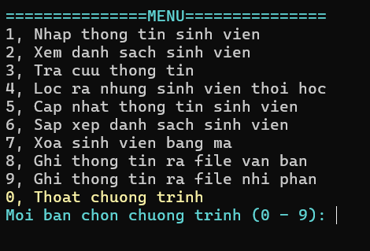

## Nhập thông tin từ bàn phím dạng bảng

- Thông báo nhập thông tin sinh viên thành công  
  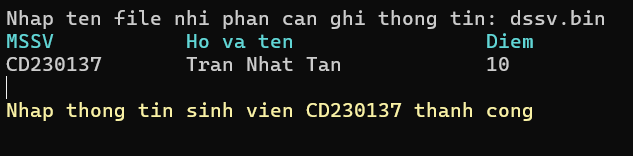
- Kiểm tra nếu nhập mã sinh viên sau trùng với sinh viên trước
  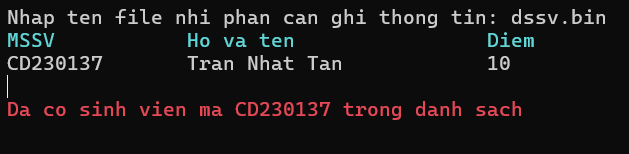
- Nhập đến khi nào mã sinh viên là rỗng thì dừng  
  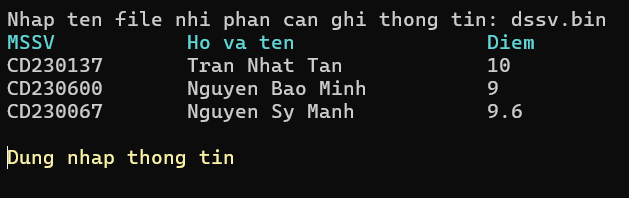
- Sau khi kết thúc nhập vẫn có thể từ menu quay lại nhập tiếp
- Dữ liệu được nhập tự động thêm vào file

## Nhập thông tin từ file nhị phân

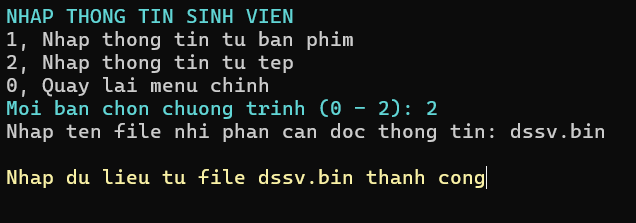

- Sau khi chọn nhập thông tin từ file, nếu muốn nhập thêm thông tin vào file, chọn nhập từ bàn phím và nhập tên file trùng với tên file ban đầu. Nếu nhập tên file khác, chương trình sẽ làm việc với file mới

## Xem danh sách sinh viên vừa nhập
## Tra cứu sinh viên bằng mã hoặc bằng tên
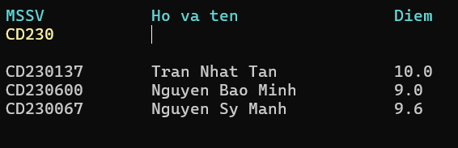
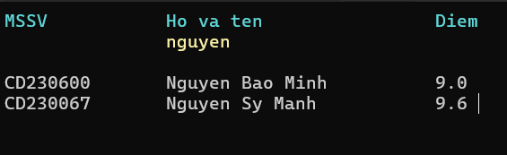
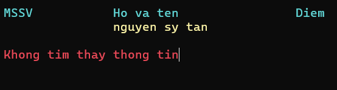

- Gõ từ khóa tìm kiếm và nhấn Enter để tra cứu, để tiếp tục tra cứu nhấn phím mũi tên sang trái hoặc sang phải. Thoát tra cứu khi không nhập từ khóa ở cả 2 cột MSSV và Họ và tên (nhấn Enter để bỏ qua bước nhập)
  

## Lọc ra những sinh viên bị buộc thôi học (có điểm nhỏ hơn 4)

- Sau khi lọc, thông tin những sinh viên bị buộc thôi học được xuất ra 1 file văn bản riêng và bị xóa khỏi file nhị phân chương trình đang làm việc với

## Cập nhật thông tin sinh viên
- Nhập mã sinh viên cần cập nhật thông tin   
 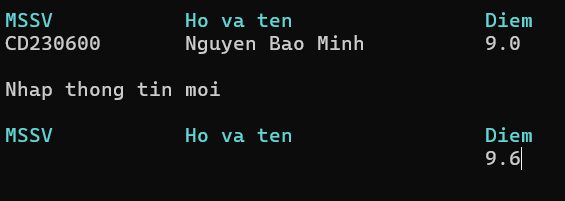
 
- Nếu cột nào không muốn cập nhật thông tin thì nhấn Enter để bỏ qua
- Nhấn Enter để bỏ qua nhập mã sinh viên cần cập nhật và hủy cập nhật
- Thông tin ở bên ngoài file cũng tự động cập nhật theo
## Sắp xếp danh sách sinh viên theo tên hoặc điểm
- Ở cột Họ và tên và Điểm, nhập "asc" hoặc "desc" và nhấn Enter để sắp xếp, hủy sắp xếp khi ở 2 côt không là "asc" và "desc"    
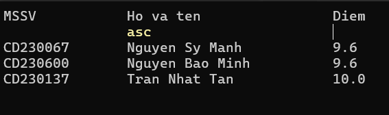
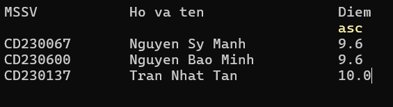
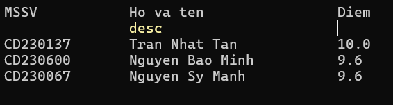
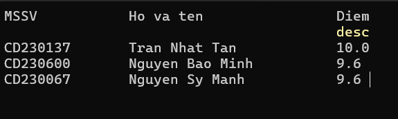

- Để tiếp tục sắp xếp, nhấn phím mũi tên sang trái hoặc sang phải
## Xóa sinh viên bằng mã sinh viên
- Nhấn Enter bỏ qua việc nhập mã để hủy xóa
## Xuất thông tin từ chương trình ra file văn bản để có thể xem thông tin trực quan
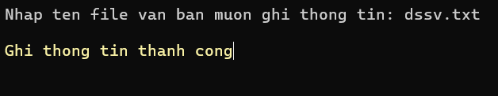
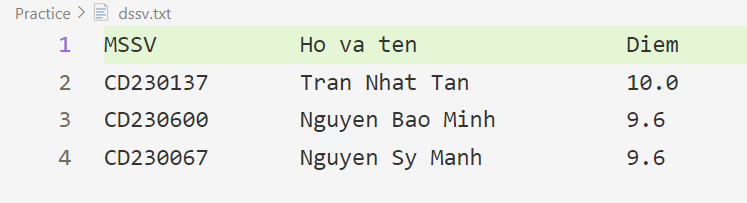

## Xuất thông tin từ chương trình ra file nhị phân để có thể lưu trữ và dùng cho các lần sau
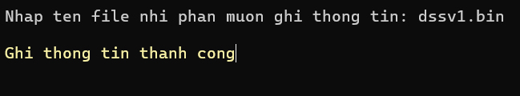
